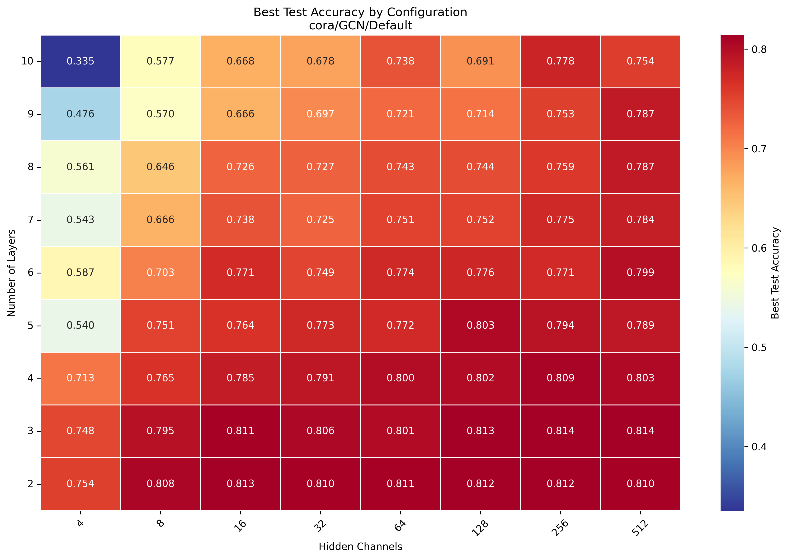
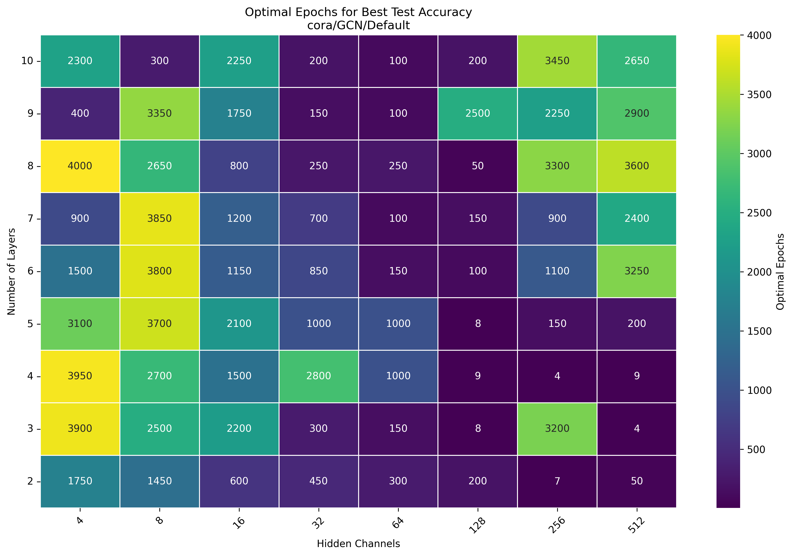
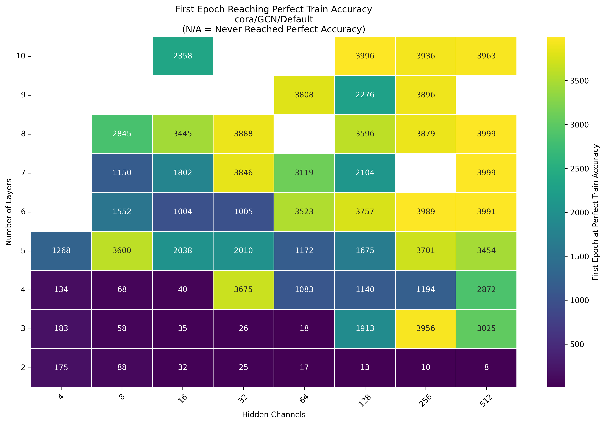
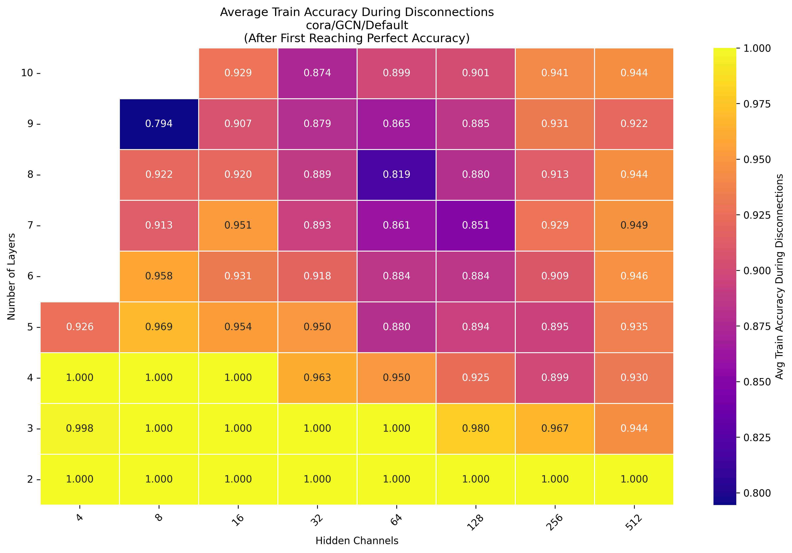
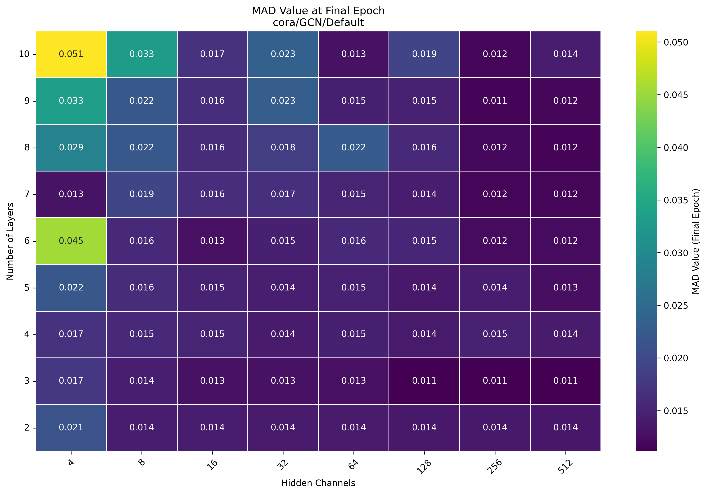
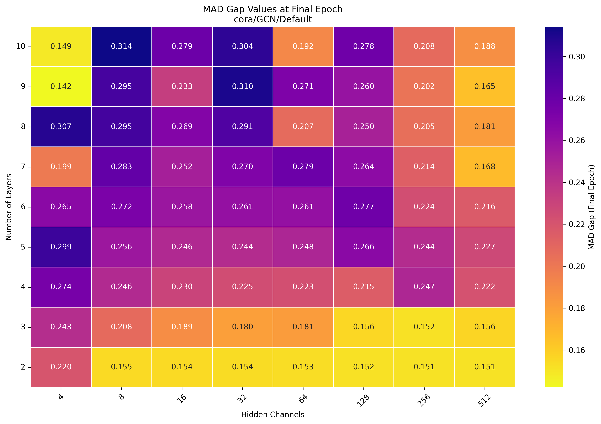

# 📊 Heatmap Visualizations for Model Evaluation

This repository contains **heatmap visualizations** for analyzing Graph Neural Network (GNN) training runs on multiple datasets using multiple model architectures. 

Each plot has the same axes:  

- **X-axis (horizontal):** Number of hidden channels (model width)  
- **Y-axis (vertical):** Number of layers (model depth)  
- **Heatmap colors and cell values:** Metric of interest (varies by plot)  

These plots together provide insights into model generalization, training dynamics, and over-smoothing behavior.  

---

## 🔑 Heatmaps and Their Meaning

### 1. Best Test Accuracy  
**File:** `best_test_accuracy_heatmap.png`  
Shows the **best test accuracy** achieved during training (early stopping).  
This is the primary metric to evaluate model generalization.  

---

### 2. Optimal Epochs for Best Test Accuracy  
**File:** `optimal_epochs_heatmap.png`  
Indicates at which **epoch** the best test accuracy occurred.  
Useful for understanding training speed and convergence stability.  

---

### 3. Final Test Accuracy  
**File:** `final_test_accuracy_heatmap.png`  
Reports the **test accuracy at the last epoch (4000)**.  
This helps compare whether models maintain performance long-term or rely on early stopping.  

---

### 4. Perfect Train Accuracy (Interpolation Point)  
**File:** `perfect_train_accuracy_heatmap.png`  
Shows the **first epoch when the training accuracy reaches 1.0 and stays there until the final epoch (4000)**.  

- Represents the point of **interpolation**.  
- Disconnections are **not considered interpolation**.  
- If the model never reached perfect accuracy, the cell is left empty.  

---

### 5. Disconnection Analysis (Train Accuracy After Perfect Fit)  
**File:** `disconnection_analysis_heatmap.png`  
Reports the **average train accuracy after the model first reached perfect accuracy**.  

- If accuracy drops later, this heatmap reflects instability and potential disconnections.  
- A stable value close to 1.0 means the model kept interpolation.  

---

### 6. MAD Value at Final Epoch  
**File:** `mad_value_final_epoch_heatmap.png`  
Shows **Mean Average Distance (MAD)** at the last epoch (4000), a **local oversmoothing measure**.  

- **Lower MAD values** → stronger information mixing between neighbors (potentially good).  
- Should be compared with MAD Gap to judge if this is beneficial or harmful.  

---

### 7. MAD Gap at Final Epoch  
**File:** `mad_gap_final_epoch_heatmap.png`  
Shows **MAD Gap values** at the final epoch (4000), a **global oversmoothing measure**.  

- **Higher MAD Gap values** → less oversmoothing across the entire graph (good).  
- Helps contextualize MAD Value results.  

---

## 🧩 Interpreting the Heatmaps Together

- **Best vs. Final Accuracy**  
  - If final accuracy is much lower than best accuracy → model benefits from early stopping.  

- **Optimal Epochs**  
  - Early peaks → risk of overfitting.  
  - Very late peaks → possible underfitting or unstable convergence.  

- **Perfect Train Accuracy + Disconnections**  
  - Early interpolation with stable training → sufficient capacity.  
  - Drops in train accuracy after reaching 1.0 → disconnections / instability.  

- **MAD Value vs. MAD Gap**  
  - Both must be analyzed together.  
  - Low MAD (local mixing) + High MAD Gap (global separation) → desirable.  
  - Low MAD + Low MAD Gap → oversmoothing.  

---

## 🚀 Quick Interpretation Guide

- ✅ **High Best Test Accuracy** → Good model config.  
- ✅ **Stable Final Accuracy ≈ Best Accuracy** → Model is reliable.  
- ⚠️ **Large gap between Best and Final Accuracy** → Early stopping is crucial.  
- ⚠️ **Very early interpolation (Perfect Train Accuracy)** → Risk of overfitting.  
- ⚠️ **Drops after perfect accuracy (Disconnections)** → Instability issues.  
- ✅ **Low MAD Value + High MAD Gap** → Healthy message passing without oversmoothing.  

---

## 📂 File Overview

| File Name                           | Meaning                                                                 |
|-------------------------------------|-------------------------------------------------------------------------|
| `best_test_accuracy_heatmap.png`    | Best test accuracy during training (early stopping).                    |
| `optimal_epochs_heatmap.png`        | Epoch at which best test accuracy occurs.                               |
| `final_test_accuracy_heatmap.png`   | Test accuracy at final epoch (4000).                                    |
| `perfect_train_accuracy_heatmap.png`| Epoch when model interpolates (train acc = 1.0 and stays there).        |
| `disconnection_analysis_heatmap.png`| Average train accuracy after reaching perfect accuracy (stability check).|
| `mad_value_final_epoch_heatmap.png` | Local oversmoothing measure (last epoch).                               |
| `mad_gap_final_epoch_heatmap.png`   | Global oversmoothing measure (last epoch).                              |

---

## 📌 Notes
- All heatmaps are dataset-specific (**Cora**, **GCN**, **Default** configuration).  
- The methodology can be extended to other datasets or architectures.  
