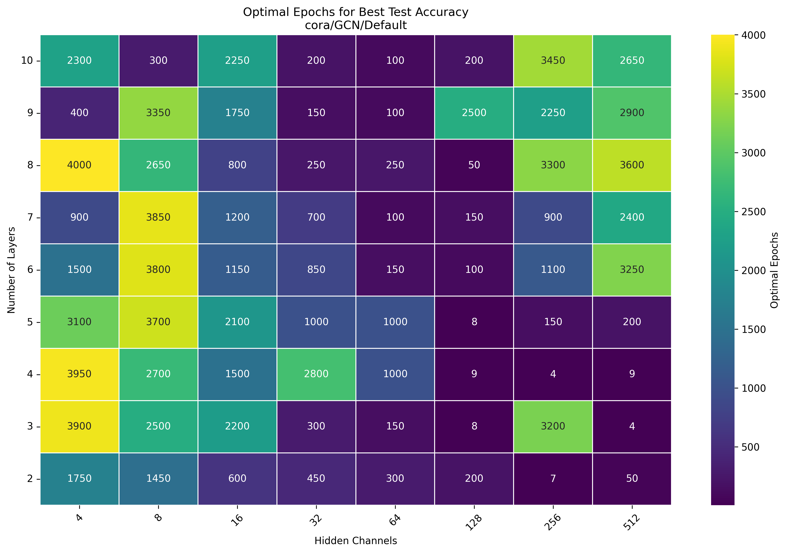
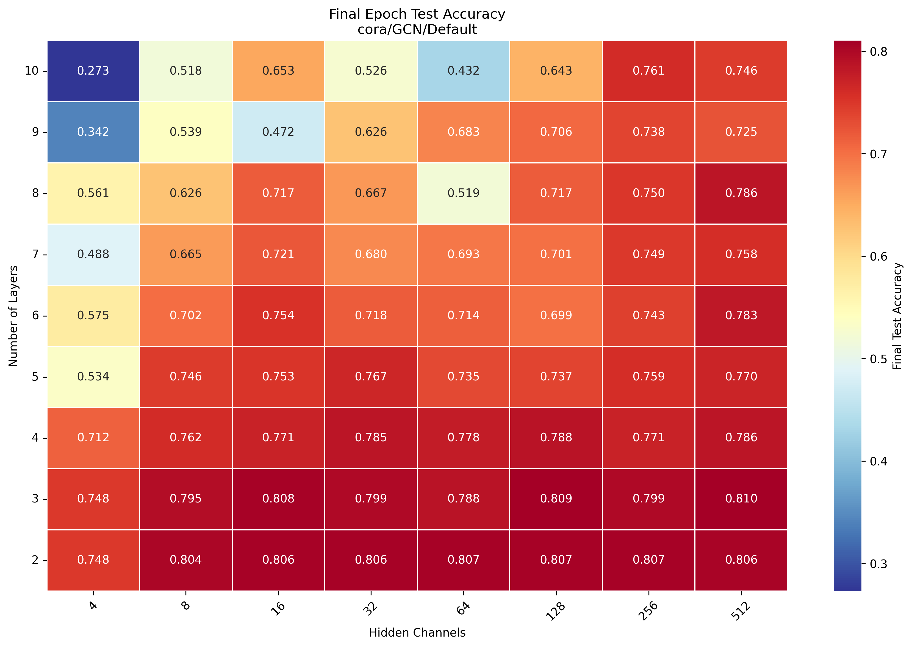
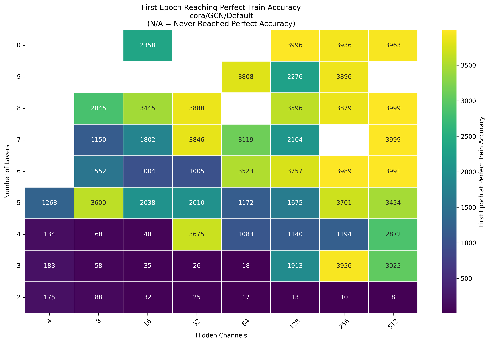
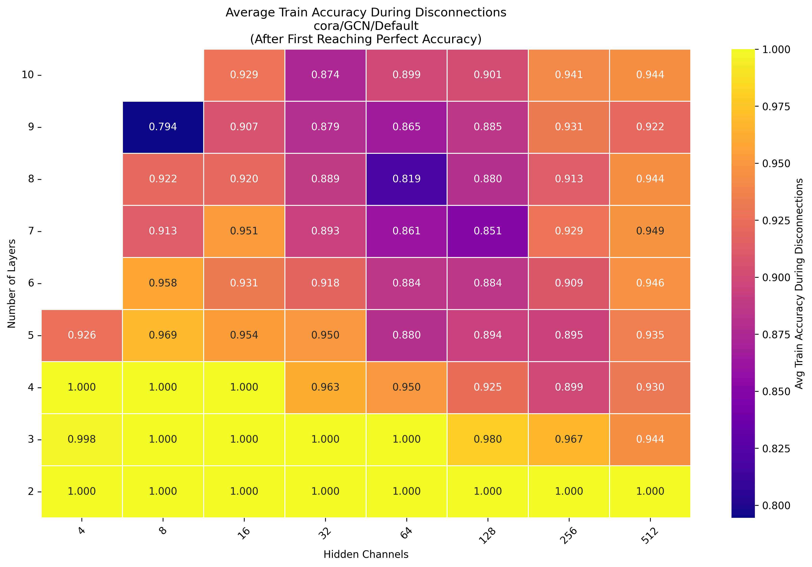
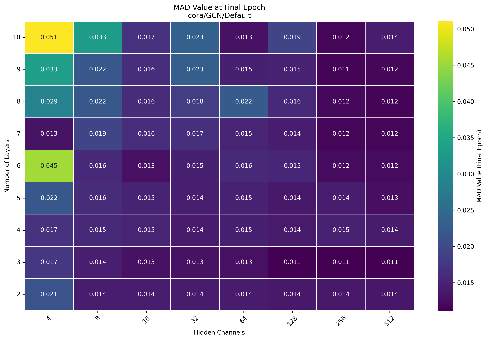
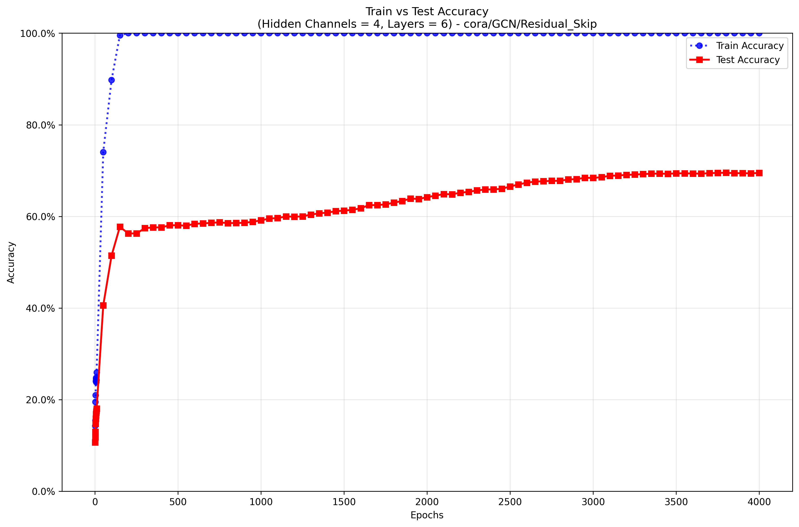
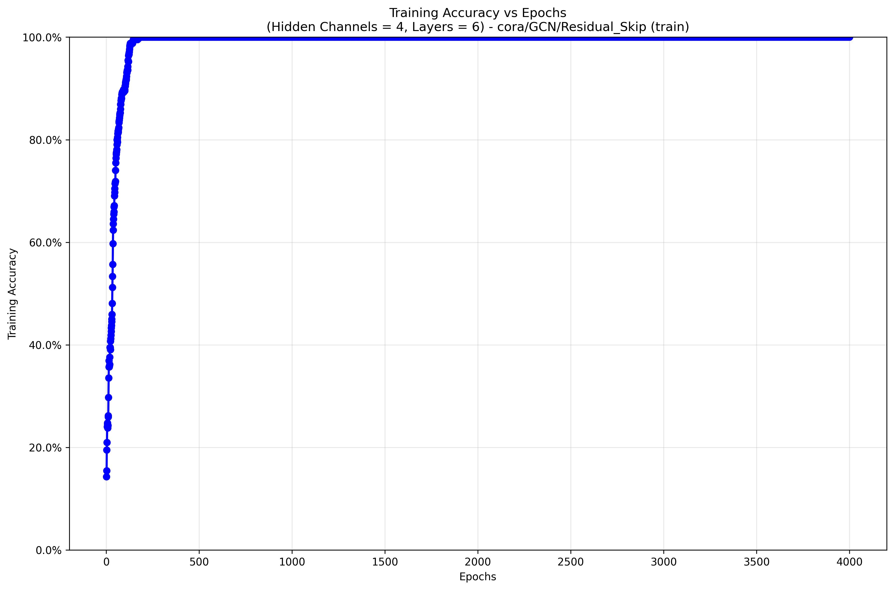
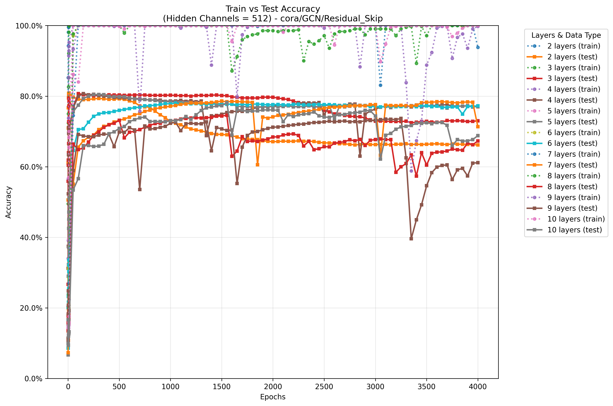
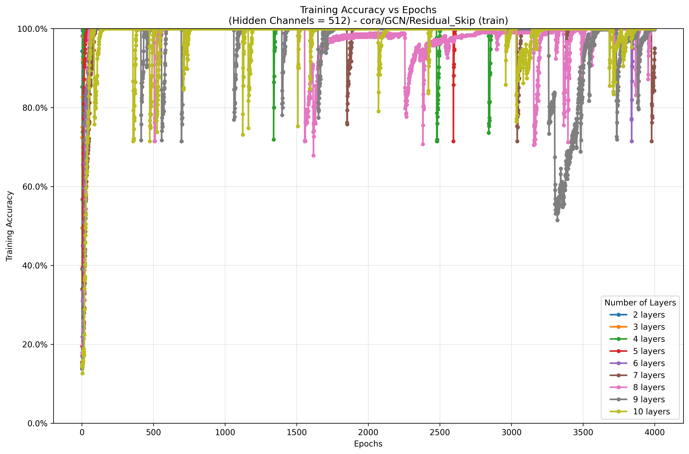

# 📊 Heatmap Visualizations for GNN Evaluation

This repository contains **heatmap visualizations** and **training curves** for analyzing Graph Neural Network (GNN) training runs.  
The experiments include both **GCN (Graph Convolutional Networks)** and **GAT (Graph Attention Networks)**, and cover tasks in:

- **Node Classification** (e.g., Cora dataset)  
- **Graph Property Prediction** (e.g., molecular or structural datasets)  

---

## 📐 General Setup

Each plot has the same axes:  

- **X-axis (horizontal):** Number of hidden channels (model width)  
- **Y-axis (vertical):** Number of layers (model depth)  
- **Heatmap colors and cell values:** Metric of interest (varies by plot)  

The plots together provide insights into **generalization**, **training dynamics**, and **over-smoothing** across model depth and width configurations.

---

## 🔑 Heatmaps and Their Meaning

### 1. Best Test Accuracy  
**File:** `examples/best_test_accuracy_heatmap.png`  
Shows the **best test accuracy** achieved during training (with early stopping).  
This is the primary metric to evaluate model generalization for both node and graph-level tasks.  

---

### 2. Optimal Epochs for Best Test Accuracy  
**File:** `examples/optimal_epochs_heatmap.png`  
Indicates at which **epoch** the best test accuracy occurred.  
Helps analyze convergence stability and speed.  

---

### 3. Final Test Accuracy  
**File:** `examples/final_test_accuracy_heatmap.png`  
Reports the **test accuracy at the final epoch (4000)**.  
Useful for comparing whether models maintain performance long-term or rely on early stopping.  

---

### 4. Perfect Train Accuracy (Interpolation Point)  
**File:** `examples/perfect_train_accuracy_heatmap.png`  
Shows the **first epoch when the training accuracy reaches 1.0 and stays there until the last epoch (4000)**.  

- Represents the point of **interpolation**.  
- Disconnections are **not considered interpolation**.  
- If a model never reached perfect accuracy, the cell remains empty.  

---

### 5. Disconnection Analysis (Train Accuracy After Perfect Fit)  
**File:** `examples/disconnection_analysis_heatmap.png`  
Reports the **average train accuracy after the model first reached perfect accuracy**.  

- If accuracy drops later, the heatmap reflects instability and potential disconnections.  
- Stable values close to 1.0 mean the model kept interpolation.  

---

### 6. MAD Value at Final Epoch  
**File:** `examples/mad_value_final_epoch_heatmap.png`  
Shows **Mean Average Distance (MAD)** at the last epoch (4000), a **local oversmoothing measure**.  

- **Lower MAD values** → stronger local neighbor information mixing (potentially good).  
- Should be compared with MAD Gap for global interpretation.  

---

### 7. MAD Gap at Final Epoch  
**File:** `examples/mad_gap_final_epoch_heatmap.png`  
Shows **MAD Gap values** at the last epoch (4000), a **global oversmoothing measure**.  

- **Higher MAD Gap values** → less oversmoothing across the graph (good).  
- Complements MAD Value analysis.  

---

## 📈 Training Curve Plots (2D)

In addition to the heatmaps, **2D training accuracy curves** are included for both **node classification** and **graph property prediction** experiments.  

For each trained **hidden_channels** setting:  
1. A **train/test plot** is provided for each number of layers.  
2. A **train-only plot** is provided showing all trained layers together.  

This makes it possible to track how train/test accuracy evolves over 4000 epochs.  

---

### Example: Hidden Channels = 4
- **Train vs Test Accuracy (per layer)**  
  

- **Training Accuracy across all layers**  
  

---

### Example: Hidden Channels = 512
- **Train vs Test Accuracy (per layer)**  
  

- **Training Accuracy across all layers**  
  

---

## 🧩 Interpreting the Heatmaps and Curves Together

- **Best vs. Final Accuracy**  
  - If final accuracy ≪ best accuracy → early stopping is crucial.  

- **Optimal Epochs**  
  - Early peaks → risk of overfitting.  
  - Very late peaks → possible underfitting or unstable training.  

- **Perfect Train Accuracy + Disconnections**  
  - Early interpolation with stability → sufficient model capacity.  
  - Drops after interpolation → instability.  

- **MAD Value vs. MAD Gap**  
  - Low MAD + High MAD Gap → healthy message passing.  
  - Low MAD + Low MAD Gap → oversmoothing.  

- **2D Training Curves**  
  - Reveal training vs test stability.  
  - Allow direct comparison of GCN vs GAT behavior.  
  - Highlight differences in **node classification** vs **graph property prediction** tasks.  

---

## 📂 File Overview

| File Name                                         | Meaning                                                               |
|---------------------------------------------------|-----------------------------------------------------------------------|
| `examples/best_test_accuracy_heatmap.png`         | Best test accuracy (early stopping).                                  |
| `examples/optimal_epochs_heatmap.png`             | Epoch at which best test accuracy occurs.                             |
| `examples/final_test_accuracy_heatmap.png`        | Test accuracy at final epoch (4000).                                  |
| `examples/perfect_train_accuracy_heatmap.png`     | Epoch when model interpolates (train acc = 1.0 and stays there).      |
| `examples/disconnection_analysis_heatmap.png`     | Average train accuracy after interpolation (stability).               |
| `examples/mad_value_final_epoch_heatmap.png`      | Local oversmoothing measure (last epoch).                             |
| `examples/mad_gap_final_epoch_heatmap.png`        | Global oversmoothing measure (last epoch).                            |
| `examples/train_test_hidden_channels_X_epochs_accuracy_Y.png` | Train/test accuracy vs epochs for HC=X and layers=Y.       |
| `examples/train_hidden_channels_X_epochs_accuracy.png`        | Training accuracy vs epochs across all layers for HC=X. |

---

## 📌 Notes
- Experiments include both **GCN** and **GAT**.  
- Covers **node classification** and **graph property prediction** tasks.  
- All results shown here use **default hyperparameters** unless otherwise stated.  
- The methodology generalizes to other datasets and architectures.  
